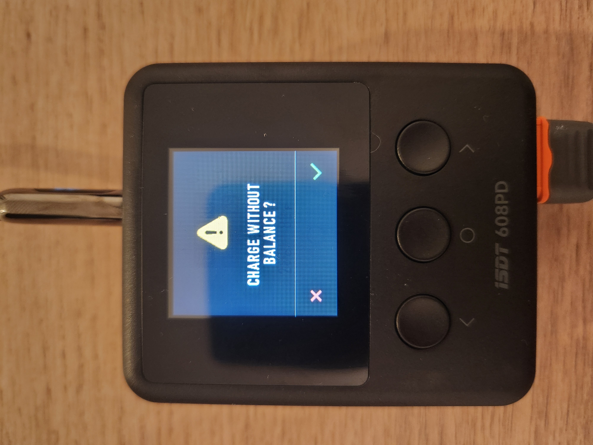

# Table of Contents

- [Introduction](#introduction)
- [Device specifications](#device-specifications)
- [CE and UKCA Certificates](#ce-and-ukca-certificates)
- [Risk Assessment](#risk-assessment)
- [Document Nomenclature](#document-nomenclature)
- [Attaching wheels](#attaching-wheels)
- [Powering on and powering off the UGV](#powering-on-and-powering-off-the-ugv)
- [Changing Passwords](#changing-passwords)
      - [sudo user / SSH password](#sudo-user--ssh-password)
        - [WiFi AP password](#wifi-ap-password)
        - [Base Station user password](#base-station-user-password)
        - [UGV tablet pin](#ugv-tablet-pin)
- [Tablet use - ROS Mobile](#tablet-use---ros-mobile)
  - [Setting up Ethernet](#setting-up-ethernet)
- [Setting up WiFi - AP](#setting-up-wifi---ap)
        - [Base Station](#base-station)
        - [Tablet](#tablet)
- [Application widget layout](#application-widget-layout)
  - [Tablet Teleoperation](#tablet-teleoperation)
    - [Emergency Stop](#emergency-stop)
- [Base Station](#base-station-1)
  - [User Information](#user-information)
  - [Network Configuration](#network-configuration)
  - [Installed Applications](#installed-applications)
        - [UGV Joystick](#ugv-joystick)
        - [UGV Keyboard](#ugv-keyboard)
        - [Filezilla](#filezilla)
        - [Terminator](#terminator)
        - [VS Code](#vs-code)
        - [Vokoscreen](#vokoscreen)
        - [VLC](#vlc)
        - [NMAP](#nmap)
        - [Anydesk](#anydesk)
        - [VNC](#vnc)
        - [OpenSSH-server](#openssh-server)
  - [Starting Teleoperation Session](#starting-teleoperation-session)
        - [Control layout](#control-layout)
        - [RVIZ](#rviz)
  - [UGV Safe Power Down](#ugv-safe-power-down)
- [Charging the UGV](#charging-the-ugv)
- [Leica BLKARC](#leica-blkarc)
      - [Downloading data](#downloading-data)
- [Mounting Third Party Sensors](#mounting-third-party-sensors)
- [API Usage](#api-usage)

# Introduction  

This user manual is intended to give the reader comprehensive safety, and operating instructions for the OSE UGV.

# Device specifications

The specifications for the OSE UGV are as follows:  
- 310 Wh battery, giving up to 36 hours operation in situ, in standby mode  
- Optional 570 Wh long range battery, giving up to 3 days in situ, in standby mode
- 41 mm ground clearance  
- 377 X 437 X 158 mm (width, length, height) without Leica BLKARC,  height of 310 mm with Leica BLKARC mounted  
- Maximum payload capacity of 10 Kg  
- Independent corner, PID controlled 4WD system (all 4 wheels have their own drive system)
- Minimum speed of 20 mm / s  
- Maximum speed of 1000 mm / s  
- USB3.0 connectivity for additional payloads  
- Optional 10/100 Ethernet connectivity for external payloads  
- Optional 48 V passive PoE or PoE+ 48 V output for external payloads (Fluke SV600, Createc NV3) - Capable of doing 3 NV3 scans without charging with default battery config, and up to 11 scans without charging with 1 Kwh option  
- 14.8 V (nominal), 4 A (maximum) GPIO controlled power bus for external payloads  
- Controlled with Android app (phone / tablet) or Linux laptop, both can be provided if the user does not have a suitable device to hand Python API available for third party integration
- Brushless DC motors 19 Kg.cm torque per corner
- Optional MPC (Modular Payload Computer) for high computational demand edge computing

# CE and UKCA Certificates

https://chick92.github.io/powerbank_instructions_mk12/CE_MK12.pdf

https://chick92.github.io/powerbank_instructions_mk12/UKCA_MK12.pdf

# Risk Assessment

https://chick92.github.io/powerbank_instructions_mk12/Risk_Assessment_usage_mk12_powerbank.pdf

# MSDS

https://chick92.github.io/ugv_block_V_instructions/MSDS.pdf

# Document Nomenclature

Any commands that must be entered in the terminal, which are written in this document will start with a $ symbol. 

$ ssh ubuntu@192.168.1.150

This command should be copied into a terminal window, without the $ symbol.

# Attaching wheels

Each UGV will come with the axles and wheels fitted, however should the user wish to remove them, it is recommended to apply loctite to each screw before inserting it. The set screws should be inserted first, and then the clamping screws to ensure a secure fitment.

Each axle features 4x M3 set screw, tapped holes, and a further 4x M3 clamping, tapped holes. It is recommended to use the included 6x M3 machine screws with both the clamping holes and the set screw holes. The 2x set screw holes closest to the tyres are not used.

# Powering on and powering off the UGV

The UGV main power switch is located on the rear of the chassis. Flip it to the up position to switch the UGV on. The indicator on the switch will light up.

If a Rajant ES1 or Rajant Cardinal is mounted to the top of the UGV, the status light will turn yellow after a few seconds, before turning white and then alternating Green, Red and Blue which indicates the radio is booting. It will then turn solid Blue, indicating it is searching for a network, and solid green when it is connected to another breadcrumb radio.

It is heavily recommended to operate the UGV via mounted Rajant network, as this can provide 512bit MAC address encryption and 256 bit AES packet encryption, and a wireless range measured in kilometers as opposed to meters with WiFi (depending on the wireless environment). Powerbanks and Rajants, shown below, can be provided by OSE or OSE distributors. 

The UGV’s WiFi Access Point (AP) will also appear after the UGV onboard computer has finished booting - the password to join this access point is “ospreysystems”

It is essential that the user does not turn the UGV off by cutting power to it. In rare cases, this can cause file corruption on the storage media used to host the operating system of the UGV. 

To turn the UGV off safely, it is recommended to SSH into the UGV computer and execute a safe shutdown command. This can be done from either the UGV tablet, in the SSH tab, or from the terminal application on the base station laptop. 

To do it with the tablet, use the SSH tab and SSH into the UGV on board computer:

Assuming the user is connected via Ethernet or Rajant, the credentials are listed below. If connected via the WiFi AP, the IP address will be 10.42.0.1

IP address = 192.168.1.150
Port = 22
Username = Ubuntu
Password = ospreysystems

Click “CONNECT”. After a few seconds a stream of text will appear detailing system information such as RAM usage, Disk usage and Network info.

In the “Terminal Input” text box, enter the following:

$ sudo reboot -h now

Enter the password if prompted - ospreysystems

The same functionality is achieved on the base station computer by using Terminator or another terminal program. Enter the following:

$ ssh ubuntu@192.168.1.150

Password is ospreysystems

Then, enter:

$ sudo shutdown -h now

# Changing Passwords

There are several default passwords that are used within the UGV ecosystem. By default they are “ospreysystems” unless specified. 

You may wish to change the default passwords as per your local cyber security rules.

#### sudo user / SSH password

SSH into the UGV

Enter the following in the terminal:

$ sudo passwd ubuntu

Follow the prompts to change the password to the desired value

##### WiFi AP password

To change this password, the user must edit the netplan configuration file that the UGV uses. 

WARNING - This file is syntax sensitive. If you edit it incorrectly you will disable network connectivity. Resolving this is a very involved procedure. Should this happen to you, please contact OSE or a distributor. Depending on your technical expertise, you may need to send the UGV back to OSE for repair.

SSH into the UGV

Enter the following command:

$ sudo nano /etc/netplan/ose_ugv_config.yaml

Use the arrow keys to navigate down to the WiFI AP section, here the SSID and password are stated in plain text. Change them as required. It is recommended you keep the cursor within the speachmarks. If you make a mistake, do not attempt to correct it. Press CTRL and X at the same time, and then N. This will exit the editor without saving the changes. 

Once you have made the changes, press CTRL and X, then Y. This will save the changes. 

You will need to tell Netplan to regenerate the configuration and then apply it: 

$ sudo netplan generate
$ sudo netplan apply

You will temporarily lose communication to the UGV, this will be restored in a few seconds. If you were connected via the WiFi AP, you will need to put the new credentials in.

##### Base Station user password

The user password can be changed in the settings menu, system settings, user.

##### UGV tablet pin

The UGV tablet runs Android 12, PIN access can be enabled / disabled / changed in the settings menu.

# Tablet use - ROS Mobile

This section requires an Android tablet or Phone, running Android 10 or later. OSE can provide a suitable device with the relevant software installed and configured. If you are using a Phone / tablet that was not set up by OSE, follow the below steps.

First, download the ROS Mobile app from the google play store. This will require a google account.

## Setting up Ethernet

If using the Rajant mesh network as the primary means of communication between UGV and tablet, a USB C to Ethernet adapter will be require. 

Connect the USB C to Ethernet adapter to the Tablet / Phone and go to Settings, Connections, More connection settings (you may have to scroll down), Ethernet.
Put the Ethernet into Static IP mode and enter the following settings:

IP Address = 192.168.1.33
Gateway = 192.168.1.1
DNS 8.8.8.8
Subnet = 255.255.255.0

Depending on your choice of tablet, some USB C to Ethernet adapters may not work due to lack of driver support built into their Android distribution. Driver support can be added, but this is beyond the scope of this document. In the authors experience, Android based phones (particularly Samsung) tend to have a significantly wider range of drivers pre installed. Android tablets (Galaxy Active Tab 3) tends to have limited driver support. However, Ethernet dongles WITHOUT anything else such as USB or HDMI typically work. Dongles with USB, HDMI etc typically do not.

Once the Ethernet is set up, open the ROS Mobile application and under the master tab, input “192.168.1.150” under the “Master URL” and “11311” under the “Master Port”

Under the Wi-Fi section (ignore the Wi-Fi name), ensure the IP address is set to that of the phone / tablet, e.g “192.168.1.33”. If you are using a phone as the base station, you will need to put the phone in airplane mode as it will try and find the UGV on the wrong subnet.

# Setting up WiFi - AP

If using the UGV’s WiFi AP, join the WiFi network using the below credentials:

SSID = OSE_UGV_V_***
PWD = ospreysystems

By default, the UGV is setup for use via Rajant or a physical tether, therefore we will need to access portainer and change the ROS master IP to reflect the fact the UGV is acting as a WiFi AP.

If you have purchased a UGV with the WiFi configuration, there is no need to make the below changes. 

Join the WiFi access point, or connect to the UGV via Ethernet or Rajant

Open the browser and navigate to the portainer interface 
10.42.0.1:9443 (wifi)
192.168.1.150:9443 (rajant or ethernet)

Login as admin, password = ospreysystems

Navigate to Stacks in the window on the left hand side

click on the UGV stack

Under the Container window click on the blue text - ugv-ugv-1

In the actions window at the top of the page, click stop. Then click on Duplicate / Edit

Under the Advanced Container Settings tab, click on ENV

for ROS_MASTER_URI enter http://10.42.0.1:11311/
for ROS_IP enter 10.42.0.1

If you wish to switch back to Ethernet / Rajant, replace the above with:

https://192.168.1.150:11311/

192.168.1.150

Then click Deploy the Container, and Replace.

##### Base Station

First you will need to determine what IP address the DHCP server on the UGV has issued to the base station. This can be done by looking at ip address under wlan0 if you enter the following command:

$ ip addr show

Make a note of the IP address shown under wlan0, it will be something like 10.42.0.*

Edit the parameters stored in the bashrc file 

$ sudo nano ~/.bashrc

export ROS_MASTER_URI=http://10.42.0.1:11311/
export ROS_IP=10.42.0.***

Where *** is the IP address shown under wlan0

press CTRL + X to exit, and Y to save the changes, then enter the following command to source the environment - 

$ source ~/.bashrc

##### Tablet

In the ros mobile application, under “Master”,  change the master IP address to 10.42.0.1. The device IP address should auto populate for you.

# Application widget layout

To properly use the UGV with the tablet, we will make use of Application Widgets. Their layout will depend on the tablet / phone you are using, due to available screen real estate. 

The widgets needed are listed below, with suitable locations on a Samsung Galaxy Active Tab 3, which is the supported tablet. To set the Widgets up, click on the “DETAILS” tab of ROS Mobile and then “Add widget”. When you enter the topic name, the message type should automatically fill.

A table of correct values and their suggested position is shown in Table below.

| Name              | X  | Y | Width | Height | Topic name                      | Button text       | X axis scale | Y axis scale |
|-------------------|----|---|-------|--------|---------------------------------|-------------------|--------------|--------------|
| Shutdown          | 13 | 1 | 2     | 1      | shutdown                        | Shutdown          |              |              |
| Estop             | 11 | 1 | 2     | 1      | estop                           | ESTOP             |              |              |
| MotEn             | 11 | 5 | 1     | 1      | motor\_enable                   | Mot En            |              |              |
| MotDis            | 11 | 4 | 1     | 1      | motor\_disable                  | Mot Dis           |              |              |
| Static pose end   | 13 | 2 | 2     | 1      | static\_pose\_end               | Static pose end   |              |              |
| Static pose start | 11 | 2 | 2     | 1      | static\_pose\_begin             | Static pose start |              |              |
| Light off         | 13 | 3 | 2     | 1      | light\_off                      | Light off         |              |              |
| Light on          | 11 | 3 | 2     | 1      | light\_on                       | Light off         |              |              |
| Stop scan         | 13 | 6 | 2     | 1      | stop\_leica                     | Stop Leica        |              |              |
| Start scan        | 11 | 6 | 2     | 1      | start\_laica                    | Start Leica       |              |              |
| Battery           | 12 | 0 | 3     | 1      | ugv\_battery                    |                   |              |              |
| Leica on          | 11 | 7 | 2     | 1      | aux\_1\_on                      | Leica on          |              |              |
| Leica off         | 13 | 7 | 2     | 1      | aux\_1\_off                     | Leica off         |              |              |
| Joystick          | 12 | 4 | 2     | 2      | cmd\_vel                        |                   | 2 to -2      | -0.5 to 0.5  |
| Camera            | 0  | 0 | 11    | 8      | /usb\_cam/image\_raw/compressed |                   |              |              |
| Reboot            | 0  | 0 | 11    | 8      | /reboot                         | Reboot            |              |              |
| Shutdown enable   | 0  | 0 | 2     | 1      | /shutdown\_enable               | Shutdown enable   |              |              |

## Tablet Teleoperation

Once the widgets are layed out and the UGV is switched on and connected to the phone / tablet via rajant / WiFi, navigate to the master tab on ROS mobile and tap the “connect” icon in the centre. It should turn Green. You can then navigate to the Viz tab and begin teleportation.

First tap the reset button, this will activate the low level controller of the UGV.

Use the Joystick to move the UGV around.

- Lights on / off will switch the drive lights on and off
- Leica on / off will power up and switch off the Leica BLK ARC - the Leica takes approximately 15 seconds to switch on and be ready to start a scan
- Static pose start and end will start and finish a static pose with the BLKARC, which essentially takes a panorama image which can be inspected in the Cyclone software
- Shutdown sends a shutdown signal to the UGV, and will safely shutdown the UGV's computer
- ESTOP deactivates the low level controller, disabling the drive motors, leica and lights. The robot requires a reboot or start / stop off the UGV software / system daemon.
- Mot En will enable torque on the UGV drive motors (enabled by default).
- Mot Dis will disable torque on the UGV drive motors. This is a low power mode and will allow the wheels to freely turn (there is sufficient gearbox friction to prevent the UGV from moving unless it is on a substantial slope).
- Shutdown enable is required to be selected before the shutdown or reboot buttons will function
- Reboot sends a reboot command to the UGV's onboard computer

### Emergency Stop

ESTOP deactivates the low level controller, disabling the drive motors, Leica and lights. The robot requires a reboot or start / stop off the UGV software / system daemon.

The easiest way to recover from an emergency stop is to power cycle the robot using the On / Off switch at the back of the robot, however if this is not accessible, the same output can be achieved through software with one of the following methods:
# Base Station
## User Information

User: ugv-base-station
Password: ospreysystems
## Network Configuration

As configured, the base station computer has a static IP address configured on its Ethernet port. This IP address is conducive to the default subnet of the UGV - 192.168.1.77.

## Installed Applications

##### UGV Joystick

This is a desktop launcher to run the ugv joystick teleoperation launch file. This will open up a terminal application which will display the battery state, and the state of lights and aux power. A camera viewer for the UGV's camera will also open. A connected joypad such as the included Xbox series S/X controller can be used to teloperate the UGV

##### UGV Keyboard

This is a desktop launcher to run the ugv keyboard teleoperation launch file. This will open up a terminal application and an camera viewer for the UGV's camera. The terminal application will display the status of the battery, aux power and lights. You can use the terminal application to control the UGV via keyboard input.
##### Filezilla

This is a file transfer application which can be used to transfer files to other computers, such as the UGV computer itself or the payload computer. Use of this application is beyond the scope of this document. The user is referred to https://wiki.filezilla-project.org/Using

##### Terminator

Terminator is a Linux terminal program. The advantage of terminator vs the stock terminal program that you can split the window horizontally or vertically, as many times as required. To do this right click in the terminal window and click "Split Vertically" etc

##### VS Code

VS Code is the chosen code editor for Osprey Systems Engineering, it is included on the base station computer for the user’s convenience.

##### Vokoscreen

Vokoscreen is a Linux screen capture application. This is useful if you wish to record a video of the UGV's PoV (Point of View) camera.

##### VLC

VLC is a video player application, that can also stream the video from the MK-12 Smart PoE Powerbanks. It is included on the base station computer for the user’s convenience.

##### NMAP

NMAP is a network scanning, terminal application. It is handy for determining the IP addresses of connected devices on the base station computer’s LAN. To use NMAP, first identify your IP address subnet. This can be done using a terminal / terminator. Enter the following command:

$ ip addr show

Ethernet networks will be under eth0, and WiFi will be under wlan0. E.g 192.168.1.77 is the default Ethernet IP address of the base station computer.

Then to scan this LAN, enter the following:

$ nmap 192.168.1.*
##### Anydesk

Anydesk is a Remote Desktop application. This is handy if you want to deploy the UGV on site with a Rajant LAN, and then access it off site. You can remote into the base station computer and take control of the UGV by using the keyboard teleperation application above. 

Use of Anydesk is strictly for private use, and is installed for the user’s convenience. To use Anydesk for commercial applications, you must pay for a license. 

##### VNC

Another remote desktop application, this is handy for accessing the MPC's desktop environment

##### OpenSSH-server

OpenSSH-server is a background SSH application that allows other computers on the LAN to SSH into the base station computer (if they have the correct credentials). IT is included here for the user’s convenience.

##### Breadcrumb Commander

Breadcrumb Commander (BC Commander) is the Rajant Mesh Network management software. Use of it is beyond the scope of this document, however, some useful information:

Admin password:
breadcrumb-admin

Crypto Officer password:
breadcrumb-co

## Starting Teleoperation Session

If using the Xbox series X/S controller, ensure it is powered on and paired with the base station computer. The controller that is provided with the base station computer has been updated to the latest firmware at the time of delivery and is already paired with the base station computer. Turn it on my pressing the XBOX symbol. It will vibrate when it is connected.

Ensure the UGV is powered on, and connected to the base station computer either through Rajant or WiFi.

Click on the desktop icon for either ugv joystick, or ugv keyboard, depending on what you want to use. an image viewing application will also launch, showing you the PoV camera feed from the front of the UGV.

##### Control layout

The control layout for the XBOX controller is as follows:

LB - dead man, press and hold to drive the UGV around
Left stick - control input for driving the UGV
B - switch on lights
X - switch off lights
Y - switch on aux power
A - switch off aux power
Arrow Pad Right - Take panoramic image when BLKARC is scanning
Arrow Pad Up - MCRS package start perimeter
Arrow Pad Down - MCRS package stop perimeter

Note that the use of the MCRS (Maximum Coverage Radiation Survey) autonomy package is beyond the scope of this document, and requires an MPC (Modular Payload Computer) and software license. Both of which are available from OSE.

##### RVIZ

RVIZ is a ROS visualisation application, that can visualise both 2D and 3D data. Depending on your application and installed software, this can be useful. The use of RVIZ is beyond the scope of this document, however the user can save RVIZ profiles so that they do not have to re enter parameters every time they use the application. To open a profile, click on the top left “open” and navigate to the .rviz file. 

Note that .rviz files should be saved to the desktop folder, this way you can make changes to the profile simply by adjusting settings in RVIZ and clicking the save button in the file menu. You can't save RVIZ configurations in the default location using this method as that folder requires root permissions to change, and RVIZ is not launched with root permissions.

To open RVIZ, once connected to the UGV through either Rajant or WIFI, enter the following in terminator / terminal:

$ rosrun rviz rviz

## UGV Safe Power Down

In order to safely power off the UGV, it is recommended to SSH into it and run the shutdown command. 

$ ssh ubuntu@192.168.1.150
pwd - ospreysystems
$ sudo shutdown now

The same is also true of the payload computer if it is mounted to the UGV.

$ ssh pi5@192.168.1.147
PWD - ospreysystems
$ sudo shutdown now

The payload computer (and any other payloads can then be powered off using the Keyboard shortcut if using the keyboard teleoperation program or the A button on the XBOX controller. 

# Charging the UGV 

Do not attempt to charge the UGV whilst it is powered on

The charging input is NOT isolated from the battery, do not attempt to connect third party devices to this port as they will draw power even when the device is turned off. 

Charge time depends on initial state of charge (SoC), however 10\% initial SoC to 80\% SoC will take approximately 3 hours. 

The UGV utilises a 4S Li-Ion battery pack with approximately 310 Wh of storage capacity for the standard model, and 570 Wh for the long range option. This allows for approximately 36 hours of operational use in the low power mode (Leica BLKARC not attached or switched off, lights switched off and low level controller switched off). This is increased to 3 days with the long range option.

It is recommended to store the UGV for extended periods of time with a battery charge state of around 50\%. It is also recommended to not operate the UGV below a 20\% battery state of charge, in order to prolong battery lifespan.

The UGV charger is an ISDT 608PD, chosen for its small form factor and USB C power input. Depending on your region, the included power supply will be either a UGREEN Nexode Pro or Anker Series 7 USB C brick. It is recommended that the user reads the included instructions of both these devices separately before use.

If using the UGREEN Nexode Pro, first connect the correct AC adapter to it, as shown below:

Plug the USB C brick into the AC outlet and connect the ISDT charger to it using the included USB C cable. The Power input on the ISDT charger is located at the top of the unit. If using the UGREEN Nexode Pro, connect the USB C cable to the port on the right hand side - USB C1 as shown below. There is only a single USB C port on the Anker Series 7.

Next connect the XT60 connector of UGV DC charging cable to the XT60 port on the bottom of the ISDT charger, and connect the DC barrel jack to the port on the rear of the UGV next to the power switch, as shown below, when connected the ISDT charger will display the input voltage and power from the USB C Power supply brick (20V, 65W for the Nexode Pro and 20V 45W for the Series 7) and the battery voltage of the UGV's onboard battery (between 12V and 16.8V):

The ISDT charger will arrive pre configured for use with the UGV and Powerbanks (if you have purchased Powerbanks). To start charging, long press the center button until the display changes to the charging menu:

Then short press the center button to begin charging. The charger will ask you if uou wish to perform an unbalanced charge. press the right button to confirm, as the UGV battery (and Powerbank battery) handles balancing via the built in BMS (Battery Management System). 

The charger will now charge the UGV. The USB C power supply brick can get hot under load, do not touch it. Do not charge the UGV or powerbank unattended!

If you wish to adjust the charging current used, you can set this before charging by long pressing the centre button within the charging menu. The parameter that flashes will be altered with the left and right buttons. Short press the centre button to cycle through them.

DO NOT change LiPo, 4S or 4.20V. This is the cell chemistry - LiPo, cell configuration - 4S and cell mav voltage - 4.20V. The charge current can be adjusted from 1A to 3A. It is best to leave it on 3A for speed of charging. If you are using a single ISDT charger for both powerbanks and the UGV, set this to 2A.

# Leica BLKARC

Two mounting brackets are provided for mounting a Leica BLKARC to the UGV. A low profile mount and a standard mount. The low profile mount is intended for environments where the access height is restricted, e.g. ducts and tunnels. However, due to the low mounting, the subsequent point cloud models will feature some ghosting from the UGV wheels. If the environment permits, use the standard mount.

Both mounts utilise 2 M5 x 20 mm and 2 M2.5 x 20 mm hex head bolts, which are included. It is recommended to plug the USB cabble and DC power cable into the BLKARC before mounting onto the UGV. Ensure the DC power cable is then connected to the AUX 1 output on the IO plate.

The UGV utilises the Leica BLKARC API to communicate with the BLKARC. Switching the device off and on, Starting and stopping scans and starting and stopping static poses can be achieved on ROS Mobile. 

The BLKARC API is run through a docker image via Portainer. 

#### Downloading data

As of the Block V hardware and software iteration, in the default state, with BLKARC connected directly to the UGV it is only possible to download BLK data by connecting to the BLK’s WiFi access point. If you have an MPC (Modular Payload Computer) connected to both the BLKARC and the UGV, you can remote into the MPC with either VNC or Anydesk, and access the BLK that way via either connecting to the BLK WiFi hotspot (or the preferred method), use the USB connection. This can be achieved by opening a web browser on the MPC and navigating to:

10.1.1.1 via WiFi

192.168.42.1 via USB Ethernet

The log in information can be found on the bottom of the BLKARC. The WiFi AP password is the same as the login password. 

If accessing the web server using the base station computer and the BLKARC’s WiFi access point, use a web browser and enter 10.1.1.1

You can also start and stop the scanner, and trigger panoramas with this method. Future software updates will allow the user to download scan data directly from the UGV. This will be delivered as a separate docker container for use with portainer. 

# Mounting Third Party Sensors

The UGV is designed to be modular, and can be configured to accept a wide variety of payloads. The default configuration does not have an Ethernet network switch, although this can easily retrofitted or specified on order if it is required. 

Payloads that utilise USB3.0 can be interfaced with ease. For additional mounting options, please contact OSE.

# API Usage

Certain customers may with to utilise the UGV API with their own software. This is fully supported by OSE. It should be noted that the default onboard computer architecture is ARM64, although this can be changed to AMD64 upon request.

In order to do this, the OSE UGV control software needs to be prevented from being initialised at startup. To do this, access the portainer interface and disable the UGV container. Doing this is beyond the scope of this document.

The API is a python library that can be obtained from OSE upon request.

Portainer is accessed via - 

https://192.168.1.150:9443

Where 192.168.1.150 is the IP address of the UGV on the Ethernet / Rajant network.

The log in details are:

user: admin
pwd: ospreysystems
